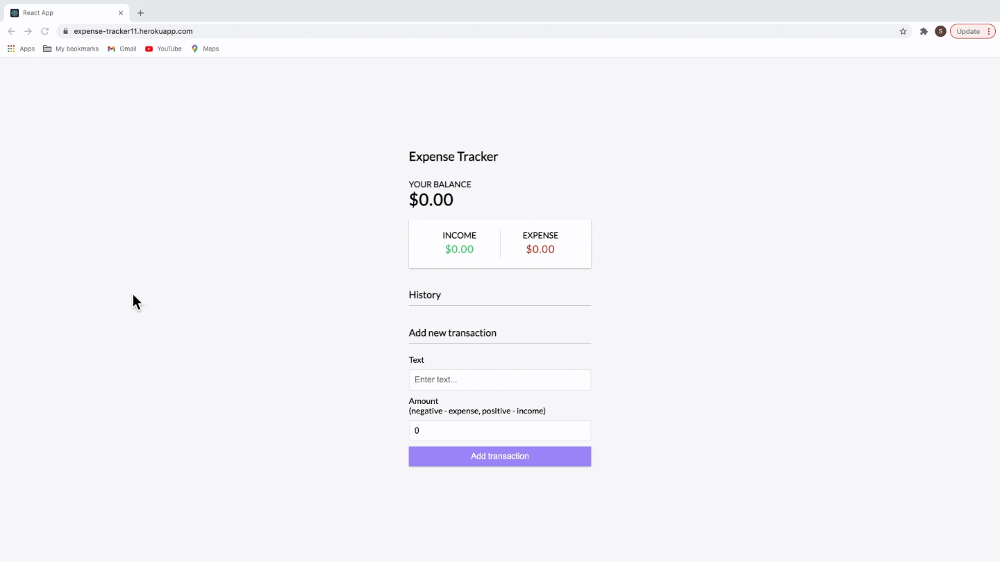

# React-Expenses-App

React-Expenses-App is an application  that gives the users  a fast and easy way to track their money and allows them to access that information anytime. 

Checkout the [Deployed app here](https://expense-tracker11.herokuapp.com/).

## Table of Contents
* [Installation](#installation)
* [Usage](#usage)
* [Technologies](#technologies)
* [Scripts](#Scripts)
* [Contributing](#contributing)
* [License](#license)
* [Questions](#questions)

## Installation

You don't need to install it, just simply go to this [Link](https://expense-tracker11.herokuapp.com/) or, if your prefer, copy this link https://expense-tracker11.herokuapp.com/ and paste in your browser.

## Usage

* Gif:

* Description:

As an user you are able to:

1. Enter deposits.

2. Enter expenses.

3. See your total budget and your entries.

## Technologies

This application utilizes `React`,`Heroku`, `CSS`, `Express`, `Morgan`, `Mongoose`, `Colors`, `Axios`.

## Scripts

In the project directory, you can run:

### `npm start`

Runs the app in the development mode.

Open [http://localhost:3000](http://localhost:3000) to view it in the browser.

## Contributing

When contributing to this repository, please first discuss the change you wish to make via issue, email, or any other method with the owners of this repository before making a change.

### Steps for contributing
1. Fork it!
2. Create your feature branch: `git checkout -b my-new-feature`
3. Commit your changes: `git commit -am 'Add some feature'`
4. Push to the branch: `git push origin my-new-feature`
5. Submit a pull request.

## License

### Inspired by `bradtraversy`

## Questions

If you have any questions or concerns, feel free to contact me via:

GitHub: [slugovoy](https://github.com/slugovoy)

Email: serg.lugovoy.81@gmail.com